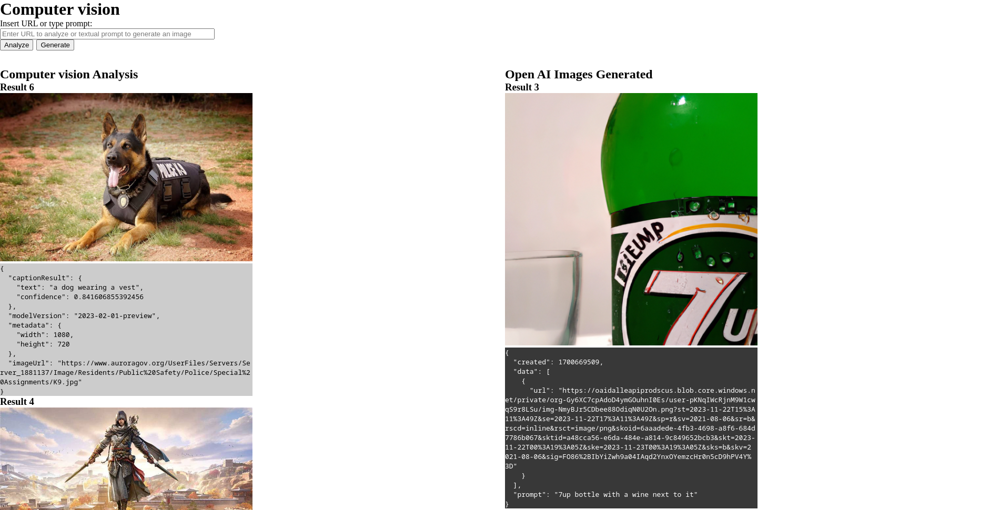

# React Azure Image Analyzer & Generation

## Preview



## Instalación

Para instalar y ejecutar este proyecto, sigue estos pasos:

1. Ejecuta el siguiente comando para cambiar a la versión adecuada de Node.js:
  ```bash
  nvm use
  ```

2. Instala las dependencias del proyecto usando npm:
  ```bash
  npm install
  ```

3. Crea un archivo `.env` en el directorio raíz del proyecto y agrega el siguiente contenido:
  ```py
  # obtener estos valores desde el portal de azure - servicio Computer Vision (tier gratuito)

  REACT_APP_OCP_APIM_KEY = "<puede encontrarse como 'Clave 1' o 'Clave 2'>"
  REACT_APP_COMPUTER_VISION_ENDPOINT = "<puede encontrarse como 'Extremo'>"

  # obtener estos valores desde la plataforma de Open AI (5 U$D credito gratuito)

  REACT_APP_OPEN_AI_KEY = "<crear una api key en la plataforma>"
  REACT_APP_OPEN_AI_GENERATION_ENDPOINT = "https://api.openai.com/v1"
  ```

4. Inicia el proyecto usando el siguiente comando:
  ```bash
  npm start
  ```

¡Eso es todo! El proyecto debería estar funcionando ahora.
